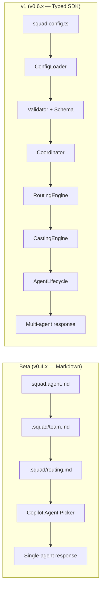
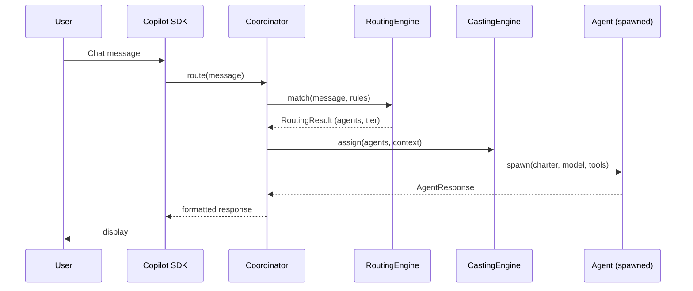
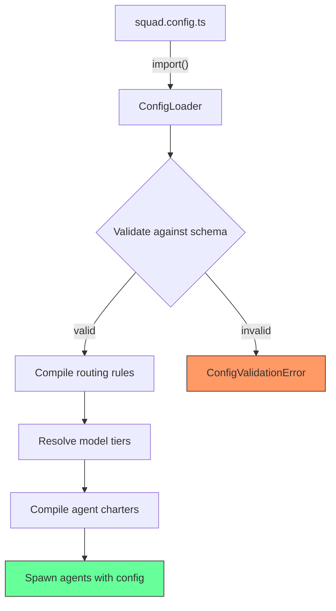
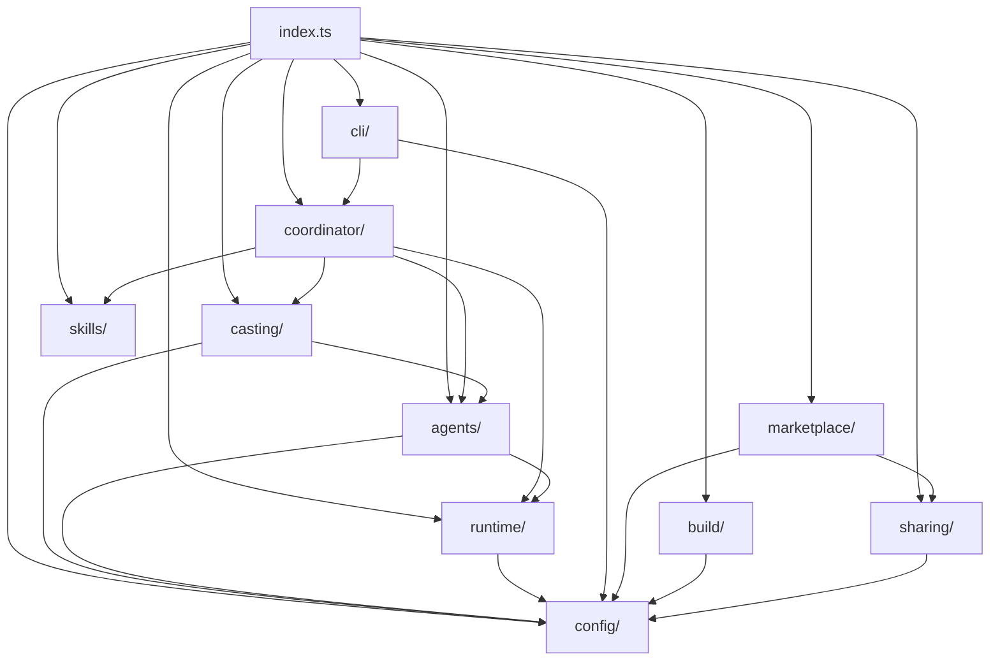
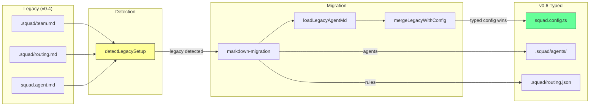

# Squad Architecture Diagrams

> Mermaid diagrams for v0.6.0 SDK architecture. Render in any Mermaid-compatible viewer (GitHub, VS Code, etc.).

---

## 1. Beta vs v1 Architecture Comparison

## 2. Data Flow — Message to Response

## 3. Config System — Load → Validate → Compile → Spawn

## 4. Module Dependency Graph

## 5. Migration Path — .squad/ (current standard)

